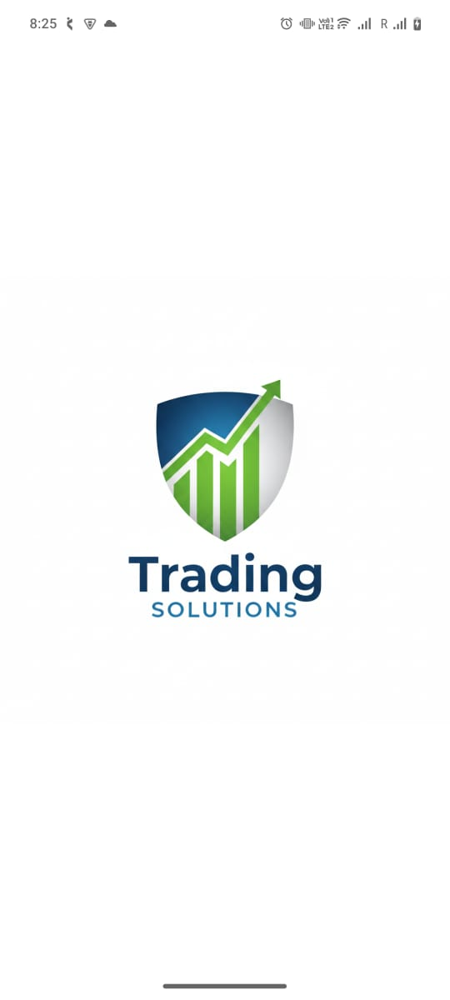
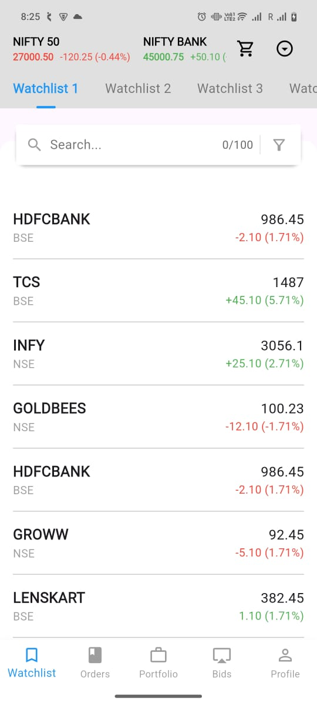
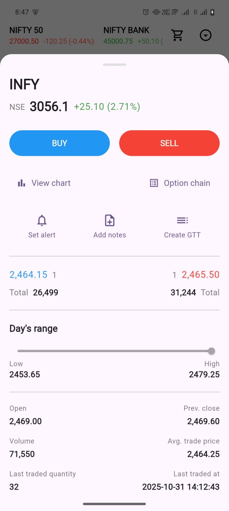
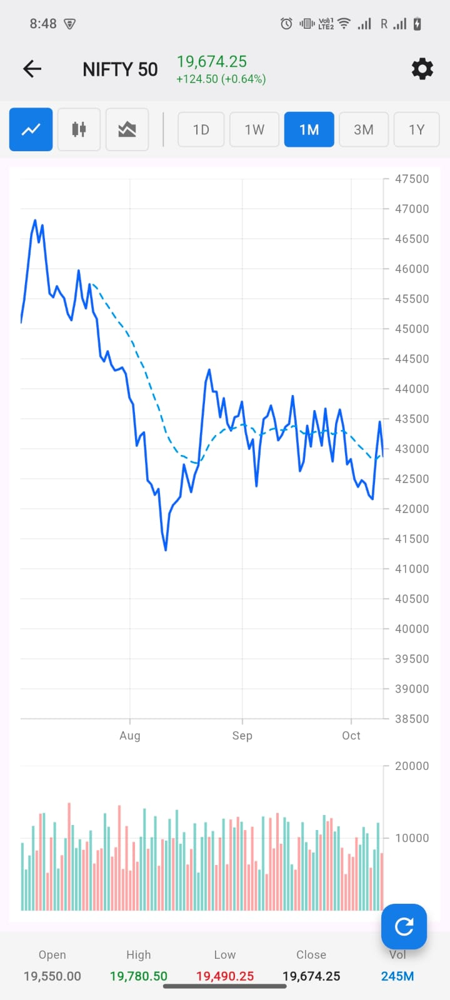
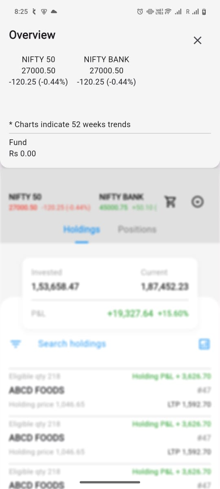
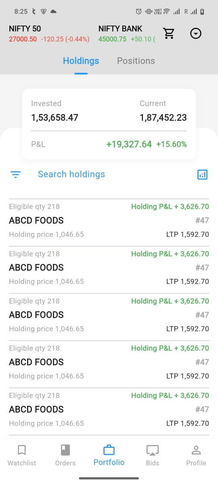
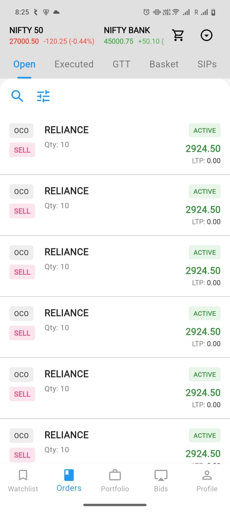
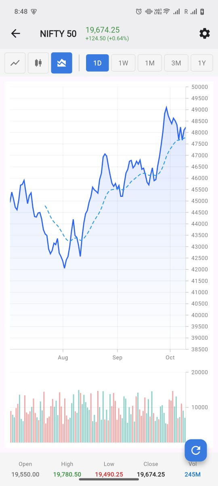
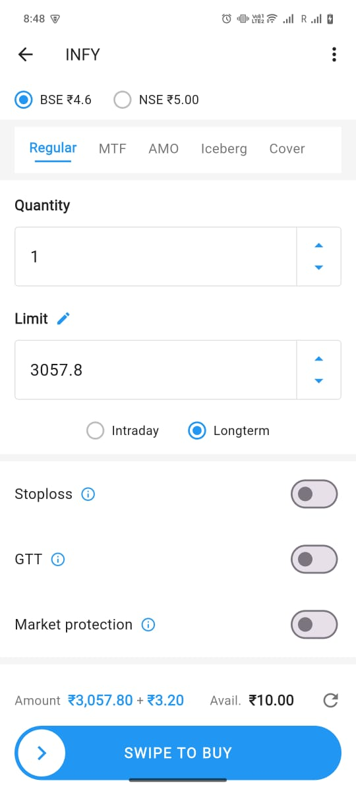

# Trading Solutions – Flutter Developer

This project is a Zerodha clone built with Flutter, showcasing a modern, responsive, and feature-rich trading application prototype. It replicates Zerodha’s core trading and portfolio management workflows and interactive charting tools using Flutter’s UI capabilities and the Syncfusion charting package. The focus is on UI fidelity, smooth navigation, and reusable widget architecture.

---

## 📱 App Screenshots & Demo

| Splash Screen   |
| :-------------: |
|  |

| Home Screen     | Stock Details   | Interactive Chart |
| :-------------: | :-------------: | :---------------: |
|  |  |  |

| TopBar       | Portfolio       | Profile         | Orders          |
| :-------------: | :-------------: | :-------------: | :-------------: |
|  |  |  |  |

| Bids            | Chart Layout    | Order Placement Sidebar |
| :-------------: | :-------------: | :---------------------: |
|  |  |  |


## 🌟 Features

**Core UI & Navigation**
- Animated Splash Screen with scaling logo
- Dashboard (Home Screen) with custom `AppBar` showing market indices
- Slide-down Animated Top Sheet with background blur for focus
- Bottom NavigationBar for easy access to Watchlist, Orders, Portfolio, Bids, Profile
- Dedicated Search screen with custom horizontal tabbed filters (Stocks, IPOs, Mutual Funds)

**Stock & Trading Features**
- Draggable and expandable Stock Details Bottom Sheet
- Interactive, fully-featured financial charts using `syncfusion_flutter_charts`
  - Line, Candlestick, Area charts
  - Multiple time frames, technical indicators (EMA, SMA, Bollinger Bands)
  - Zoom, pan, trackball functionality
- BUY/SELL order placement screens with custom swipe-to-confirm button preventing accidental actions

**Custom Widgets & Components**
- `MarketAppBar`, `CustomTabbedView`, `SwipeToConfirmButton`, `StockDetailsSheet`
- Reusable card widgets like: `CompanyCard`, `InvestmentCard`, `HoldingCard`, `OrderItemCard`
- Modular, single-responsibility widgets composing the UI effectively

---

## 🛠️ Tech Stack & Architecture

- **Framework:** Flutter (Dart)
- **State Management:** `StatefulWidget` with `setState()` (simple and suitable for technical assessment; scalable to BLoC or Riverpod)
- **Key Packages:** `syncfusion_flutter_charts`
- **Architecture:** Widget-based composition, separation into `screens` and `widgets`, data-driven UI designed for maintainability

---

## 🚀 Setup Instructions

1. **Prerequisites:**
   - Install [Flutter SDK](https://docs.flutter.dev/get-started/install)
   - Use an IDE like VS Code or Android Studio with Flutter plugin installed
   
2. **Clone the repository:**

    ```
    git clone https://github.com/prabalmaurya08/tradingsolutions.git
    cd tradingsolutions
    ```

3. **Install dependencies:**

    ```
    flutter pub get
    ```

4. **Run the app on an emulator or physical device:**

    ```
    flutter run
    ```

5. **(Optional) Build release APK:**

    ```
    flutter build apk --release
    ```

---

## 🗂️ Folder Structure

lib/
├── main.dart # Entry point
├── screens/ # Feature screens (Home, StockDetails, Charts, etc.)
├── widgets/ # Reusable UI components
├── models/ # Data models
├── utils/ # Helpers, constants
assets/
├── images/
├── icons/
└── fonts/

text

---

## 💡 Potential Future Enhancements

- Implement advanced state management (e.g., `flutter_bloc`, `riverpod`) for better scalability
- Integrate real-market data APIs for live updates
- Add user authentication (login/signup)
- Write unit & widget tests
- Advanced theming support (light/dark mode)

---

## 📦 Deliverables

- **GitHub Repository:** https://github.com/prabalmaurya08/tradingsolutions


---

## 👤 Developer

**Name:** Prabal  
**Role:** Flutter Developer   
**Date:** November 2025

---
